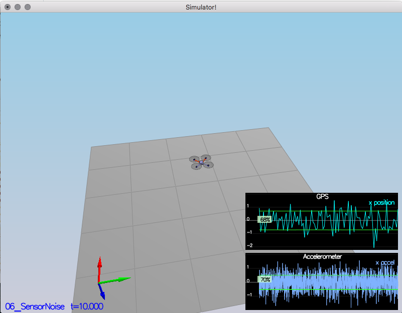
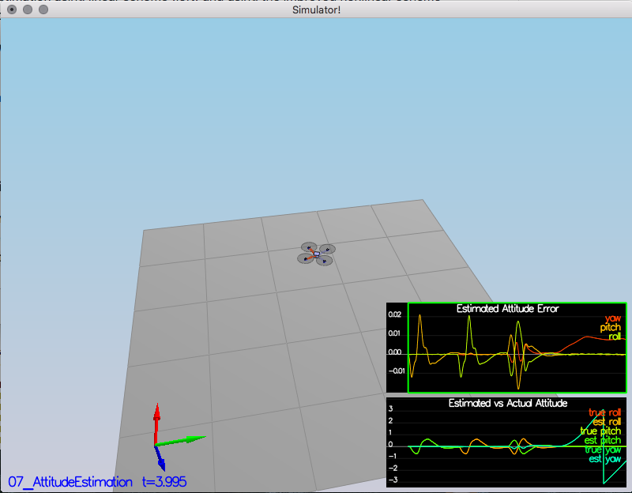

# Project Write-up: 3D Quad Estimation using EKF

---
#### 1. Provide a Writeup / README that includes all the rubric points and how you addressed each one.  You can submit your writeup as markdown or pdf.

You're reading it!
Here I will consider the [rubric](https://review.udacity.com/#!/rubrics/1807/view)
points individually and describe how I addressed each point in my implementation.

### Implement Estimator

#### 1. Determine the standard deviation of the measurement noise of both GPS X data and Accelerometer X data.

After running `Scenario 6: Noise Sensors` we find files
- config/log/Graph1.txt
- config/log/Graph2.txt

containing logged data from GPS and accelerometer that looks like this:
```
time, Quad.GPS.X
0.105000,0.929727
0.205000,-0.850977
```

Using simple `python` code we can calculate standard deviations from that data:

```
>>> import numpy as np
>>> g1 = np.genfromtxt('config/log/Graph1.txt',delimiter=',',skip_header=1)
>>> print("GPS.X std = {}".format(np.std(g1[:,1])))
GPS.X std = 0.598544329703513
>>> g2 = np.genfromtxt('config/log/Graph2.txt',delimiter=',',skip_header=1)
>>> print("Accelerometer.X std = {}".format(np.std(g2[:,1])))
Accelerometer.X std = 0.5115638316431003
```

When plugging the data into `06_SensorNoise.txt` we see that empirically ~68% of observations fall
within found estimates of standard deviation:



#### 2. Implement a better rate gyro attitude integration scheme in the `UpdateFromIMU()` function.

Requrements:
* attitude estimation of < 0.1 rad for each of the Euler angles for a
at least 3 seconds
* use quaternions to improve
performance over the current simple integration scheme

We implement non-linear complimentary filter as described in section 7.1.2 of
[Estimation for Quadrotors](https://www.overleaf.com/read/vymfngphcccj#/54894644/)

This is what our part of the code looks like:

```
  //ekfState: x,y,z,vx,vy,vz,yaw
  Quaternion<float> q = Quaternion<float>::FromEulerYPR(ekfState(6), pitchEst, rollEst);
  Quaternion<float> dq;
  dq.IntegrateBodyRate(gyro, dtIMU); // will overwrite dq, i.e. integrate from zero
  Quaternion<float> q_bar = dq * q;

  float predictedPitch = q_bar.Pitch();
  float predictedRoll = q_bar.Roll();
  ekfState(6) = q_bar.Yaw();	// yaw
```

The rest of the code remains unchanged, i.e.
* the yaw angle gets adjusted to be between -PI and PI
* gyro and accelerometer readings get fused with `tau=1.0`

The resulting non-linear complimentary filter implementation
is doing a great job, significantly improving errors between
ground truth and the estimated roll/pitch/yaw:




Here's | A | Snappy | Table
--- | --- | --- | ---
1 | `highlight` | **bold** | 7.41
2 | a | b | c
3 | *italic* | text | 403
4 | 2 | 3 | abcd


