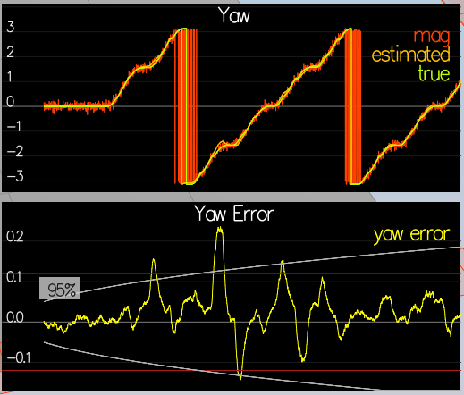

# Project Write-up: 3D Quad Estimation using EKF

---
#### 1. Provide a Writeup / README that includes all the rubric points and how you addressed each one.  You can submit your writeup as markdown or pdf.

You're reading it!
Here I will consider the [rubric](https://review.udacity.com/#!/rubrics/1807/view)
points individually and describe how I addressed each point in my implementation.


### Implement Estimator


#### 1. Determine the standard deviation of the measurement noise of both GPS X data and Accelerometer X data.

After running `Scenario 6: Noise Sensors` we find files
- config/log/Graph1.txt
- config/log/Graph2.txt

containing logged data from GPS and accelerometer that looks like this:
```
time, Quad.GPS.X
0.105000,0.929727
0.205000,-0.850977
```

Using simple `python` code we can calculate standard deviations from that data:

```python
>>> import numpy as np
>>> g1 = np.genfromtxt('config/log/Graph1.txt',delimiter=',',skip_header=1)
>>> print("GPS.X std = {}".format(np.std(g1[:,1])))
GPS.X std = 0.598544329703513
>>> g2 = np.genfromtxt('config/log/Graph2.txt',delimiter=',',skip_header=1)
>>> print("Accelerometer.X std = {}".format(np.std(g2[:,1])))
Accelerometer.X std = 0.5115638316431003
```

When plugging the data into `06_SensorNoise.txt` we see that empirically ~68% of observations fall
within found estimates of standard deviation:


#### 2. Implement a better rate gyro attitude integration scheme in the `UpdateFromIMU()` function.

Requrements:
* attitude estimation of < 0.1 rad for each of the Euler angles for a
at least 3 seconds
* use quaternions to improve
performance over the current simple integration scheme

We implement non-linear complimentary filter as described in section 7.1.2 of
[Estimation for Quadrotors](https://www.overleaf.com/read/vymfngphcccj#/54894644/)

This is what our part of the code looks like:

```cpp
  //ekfState: x,y,z,vx,vy,vz,yaw
  Quaternion<float> q = Quaternion<float>::FromEulerYPR(ekfState(6), pitchEst, rollEst);
  Quaternion<float> dq;
  dq.IntegrateBodyRate(gyro, dtIMU); // will overwrite dq, i.e. integrate from zero
  Quaternion<float> q_bar = dq * q;

  float predictedPitch = q_bar.Pitch();
  float predictedRoll = q_bar.Roll();
  ekfState(6) = q_bar.Yaw();	// yaw
```

The rest of the code remains unchanged, i.e.
* the yaw angle gets adjusted to be between -PI and PI
* gyro and accelerometer readings get fused with `tau=1.0`

The resulting non-linear complimentary filter implementation
is doing a great job, significantly improving errors between
ground truth and the estimated roll/pitch/yaw:


#### 3. Implement all of the elements of the prediction step for the estimator.

Requirements:
* should include the state update element (`PredictState()` function),
* correct calculation of the Rgb prime matrix, and
* a proper update of the state covariance.
* The acceleration should be accounted for as a command in the calculation of gPrime.
* The covariance update should follow the classic EKF update equation.

We first implement `QuadEstimatorEKF::PredictState` -- the EKF prediction step
for *state*.
We use `Scenario 8: noiseless IMU` and modify the code as follows:

```cpp
  //ekfState: x,y,z,vx,vy,vz,yaw
  predictedState(0) += curState(3)*dt;
  predictedState(1) += curState(4)*dt;
  predictedState(2) += curState(5)*dt;
  // controls vector u = acc_x_b, acc_y_b, acc_z_b, yaw_change
  V3F rot_u = attitude.Rotate_BtoI(accel);
  predictedState(3) += rot_u.x * dt;
  predictedState(4) += rot_u.y * dt;
  predictedState(5) += (-CONST_GRAVITY + rot_u.z) * dt;
  //yaw is already integrated in UpdateFromIMU
```

Running in simulator shows that we have some drifts in our estimate
of the state, as expected
without the measurement update, but they are small
for *noiseless*
sensors:


We then transition to `Scenario 9: IMU with noise` and implement
covariance update. But first we modify `GetRbgPrime()` function --
partial derivative
of the body-to-global rotation matrix w.r.t. yaw:

```cpp
  RbgPrime(0,0) = -cos(theta) * sin(psi);
  RbgPrime(0,1) = -sin(phi) * sin(theta) * sin(psi) - cos(phi) * cos(psi);
  RbgPrime(0,2) = -cos(phi) * sin(theta) * sin(psi) + sin(phi) * cos(psi);

  RbgPrime(1,0) = cos(theta) * cos(psi);
  RbgPrime(1,1) = sin(phi) * sin(theta) * cos(psi) - cos(phi) * sin(psi);
  RbgPrime(1,2) = cos(phi) * sin(theta) * cos(psi) + sin(phi) * sin(psi);

  RbgPrime(2,0) = 0.f;
  RbgPrime(2,1) = 0.f;
  RbgPrime(2,2) = 0.f;
```

then we implement full state (including covariance) update in `Predict()`.
In particular the code that we modified looks as follows:


```cpp
  gPrime(0,3) = dt;
  gPrime(1,4) = dt;
  gPrime(2,5) = dt;
  gPrime(3,6) = dt * (RbgPrime(0,0) * accel[0] + RbgPrime(0,1) * accel[1] + RbgPrime(0,2) * accel[2]);
  gPrime(4,6) = dt * (RbgPrime(1,0) * accel[0] + RbgPrime(1,1) * accel[1] + RbgPrime(1,2) * accel[2]);
  gPrime(5,6) = dt * (RbgPrime(2,0) * accel[0] + RbgPrime(2,1) * accel[1] + RbgPrime(2,2) * accel[2]);

  ekfCov = gPrime*(ekfCov*gPrime.transpose()) + Q;
```

And having done this we adjust the following parameters in `config/QuadEstimatorEKF.txt`
so that empirical plots of covariance grew with time roughly
at the rate of covariance growth in the data:

```
QPosXYStd = .05
QVelXYStd = .15
```

And this is what we see in simuation with our implementation and
updated settings:


#### 4. Implement the magnetometer update.

Requirements:
* should properly include the magnetometer data into the state
* should make sure to correctly measure the angle error between the current state and the magnetometer value (error should be the short way around, not the long way)

We run `Scenario 10: Magnetometer Update` and see the yaw estimation
error before taking into account the magnetometer measurements.
We tune `QYawStd = .04` so that uncertainty in yaw estimate grows
roughly as data:



We then proceed to implement `UpdateFromMag()` function as
follows:

```cpp
  //ekfState: x,y,z,vx,vy,vz,yaw
  hPrime(6) = 1.f;
  MatrixXf tmp = hPrime * (ekfCov * hPrime.transpose()) + R_Mag;
  MatrixXf K = ekfCov * hPrime.transpose() * tmp.inverse();

  float diff = magYaw - ekfState(6);
  if (diff > F_PI) diff -= 2.f*F_PI;
  if (diff < -F_PI) diff += 2.f*F_PI;
  zFromX(0) = magYaw - diff;

  ekfState += K * (z - zFromX);

  MatrixXf eye(QUAD_EKF_NUM_STATES,QUAD_EKF_NUM_STATES);
  eye.setIdentity();
  ekfCov = (eye - K*hPrime) * ekfCov;
```

This works as expected and we then tune `QYawStd = .12` so that
empirically our errors in yaw measurement using magnetometer
be within about one standard deviation of the true value.


Here's | A | Snappy | Table
--- | --- | --- | ---
1 | `highlight` | **bold** | 7.41
2 | a | b | c
3 | *italic* | text | 403
4 | 2 | 3 | abcd


